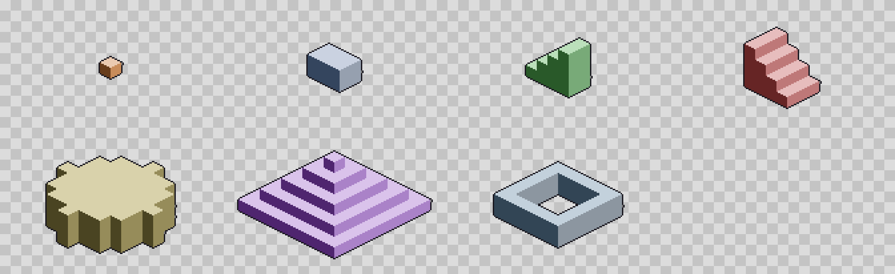

# 等距构建（IsoBuilder 式三视图 → 等距像素画）· 方案与 UX 设计

> 上游参考：[Aseprite Community 帖子](https://community.aseprite.org/t/extension-isobuilder-an-extension-for-creating-isometric-pixel-art/28612)
> （作者 HasuDelFuturo）、[itch 页面](https://hasudelfuturo.itch.io/isobuilder)、
> 演示视频 [1](https://www.youtube.com/watch?v=OQsycHCA1Mc) / [2](https://www.youtube.com/watch?v=0FLeQS32IT4)。
> 该扩展**没有公开源码**，我们只做功能等价、独立实现（算法是教科书内容：三视图求视觉外壳 + 等距投影）。

---

## 0. 已定的口径（用户拍板 2026-09-13）

| 项 | 决定 |
|---|---|
| 投影比例 | **2:1**（菱形的宽高比 2:1，像素画惯例，≈26.57°）；**不用**真等距 30° |
| 实现方式 | **自研**，不移植上游代码 |
| 产品定位 | **一个可调整的基础等距图形生成器** —— 先把「盒子类基本体」做扎实，再慢慢加形状与高级模式 |
| 迭代策略 | 形状库 + 参数面板是可扩展的纯函数清单，每版加几个形状、加一档参数，不推倒重来 |

> ⚠️ 现有等距**网格辅助线** `View.drawIsoGuide()` 画的是真 30°（历史实现）。渲染必须是 2:1，
> 两者并存会让用户对不齐 → **本次顺带给网格加一档「2:1 等距」**（见 §6 v1 清单），默认工作区用 2:1。

---

## 1. 上游功能拆解（作为需求参考，不是实现目标）

| 上游功能 | 说明 | 我们的安排 |
|---|---|---|
| 2×2 四宫格工作区 | FRONT / SIDE / TOP / PREVIEW | v3「高级模式」沿用这个思路（见 §7） |
| 三视图 → 等距预览 | 三个正交剪影求视觉外壳 | v3 高级模式（不是主线，见 §0 定位） |
| 预览是可编辑图层 | 生成完就是普通像素 | ✅ v1（写进新建的 `iso` 图层） |
| 原始面颜色 / 默认等距色 | 顶面亮、侧面暗 | ✅ v1，明暗直接复用 `engine/shading.ts` |
| 自动阴影 | 地面上的投影 | ✅ v1 接触阴影，v2 方向投影 |
| 工作区尺寸可调 | 每象限边长 | ✅ v1（我们的「图块尺寸」是像素档位，更贴近像素画） |
| 逐帧渲染 | 等距动画 | ✅ v3（原版还没有，是我们的超车点） |
| 左右视角 / 实时预览 | 原版仅在待办 | v2 左右视角；v3 多画布实时联动 |

---

## 2. 2:1 像素几何（已定，写死并锁进黄金测试）

一个「格子」在地面上是 **`T×T/2`** 像素的菱形；**1 单位高度 = `T/2` 像素**。
于是 **1×1×1 的立方体正好是 `T×T` 像素**（顶面菱形 `T×T/2` + 两个侧面各 `T/2` 高），
外框是正方形 —— 好对齐、好点数，也正好是像素画里那种等距方块。

```
sx = (x - y) * (T/2)                    // 每向右一格：+T/2 px
sy = (x + y) * (T/4) - z * (T/2)        // 每向前一格：+T/4 px；每升高一格：-T/2 px
```

`T` 取 **8 / 16 / 32**（都能被 4 整除 ⇒ 全部落在整数像素上）：

| T | 顶面菱形 | 每单位高度 | 1×1×1 立方体外框 | 适用 |
|---|---|---|---|---|
| 8 | 8×4 px | 4 px | 8×8 px | 图标 / 小物件 |
| 16（默认） | 16×8 px | 8 px | 16×16 px | 通用（箱子、家具、角色底座） |
| 32 | 32×16 px | 16 px | 32×32 px | 大件、建筑 |

**立方体的行宽（黄金值，T=16，自上而下 16 行）**：
`2, 6, 10, 14, 16, 16, 16, 16, 16, 16, 16, 16, 14, 10, 6, 2`（合计 192 px，
其中顶面菱形占 `2,6,10,14,14,10,6,2` = 64 px）。这套行宽**恰好能铺满平面**
（相邻格偏移 `(T/2, T/4)`，六边形无缝无叠），所以直接拿它当 `isoRender` 的模板。

绘制顺序（画家算法）：按 `x + y` 递增（远 → 近），同一深度内 `z` 递增（下 → 上）；
每个体素按 **顶面 → 两个侧面** stamp，且只画**未被遮挡**的面
（顶面：上方无体素；右面：`+x` 邻居为空；左面：`+y` 邻居为空）。

---

## 3. 引擎设计（可扩展的形状库）

> ✅ **本节的几何与形状库已经实现并通过测试**：`src/engine/iso.ts` + `tests/iso.test.ts`
> （3694 条断言全绿；其中 ~90 条是等距专用的黄金值与不变量）。
> 口径改动会先让这些黄金值变红，不会出现「看着不对但说不清哪里不对」。

```ts
// 形状库（已实现）
isoShapeVoxels(p: IsoShapeParams): Voxels          // box / steps / wedge / cylinder / pyramid / frame
normalizeShapeParams(p): IsoShapeParams            // 夹取 + 半径/壁厚上限 + 体素上限 262144
isoFaceColours(base, shade?): { top; right; left } // 单色三档，复用 engine/shading.ts
isoDiamondRows(tile) / isoHexRows(tile)            // 行宽模板（黄金值的来源，别再手推）
isoRender(v: Voxels, look: IsoLook): IsoRenderResult  // { px, w, h, voxels, pixels }，紧凑缓冲、左上即外接框
isoRenderShape(shape, base, look?): IsoRenderResult   // 便捷入口（面板用）
isoShadowOffset(tile) / isoWithinBudget(w,d,h) / ISO_TILES / ISO_SHAPE_DEFAULTS
prism(w, d, h, sides)                              // 棱柱（2:1 足迹的正 n 边形）—— v2
```

```ts
// 面板/会话侧要用的外观参数（形状参数另存，分开持久化）
interface IsoLook {
  tile: 8 | 16 | 32;                 // 每格像素宽（2:1 固定：顶面 T×T/2、每单位高度 T/2）
  faces: { top: RGBA; right: RGBA; left: RGBA };
  shadow: "off" | "contact";         // v2 加 "cast"（方向投影）+ shadowDir
  shadowColor: RGBA;
  outline: boolean; outlineColor: RGBA;   // 1px 暗边
}
```

设计要点（都已落地）：
- **形状与渲染解耦**：渲染器只认 `Voxels`，新形状不影响渲染与测试；
- **只画到外接框**：先扫一遍求包围盒，再往缓冲写，画布再大也不慢；
- **行凸不变量**：渲染结果每一行的实心像素必须是**一段连续 run**（`rowConvex`），
  这是抓「stamp 错位 / 有洞」的通用探针，多体素用例全靠它；
- **一条撤销**：`isoRender` 只产出像素，落历史由 `Session` 负责（见 §5）。

---

## 4. UX 设计（重点）



> 上图是**已经跑通的引擎**（`src/engine/iso.ts`）在 T=16 下生成的真实输出（3× 放大）：
> 立方体 / 3×2×2 箱体 / 四阶楼梯 / 楔形 / 圆柱 / 金字塔 / 空心框；
> 默认带接触阴影与 1px 暗边，底色是透明棋盘格。生成它的脚本是一次性工具，不入库。

### 4.1 设计原则

1. **先出图、再精修**：点一下就能得到一个立方体，不逼用户先填数字。
2. **就地直接操作**：尺寸用**画布上的抓手**拖出来，数字只是回显与微调。
3. **预览不落笔**：拖动时只画半透明预览（覆盖层），松手才写像素 —— 与现有「变形 / 变形工具」的语义一致。
4. **一次操作一条历史**：生成、改参、移动、改高，各算一条；随时可撤销。
5. **可迭代**：形状库与参数都在面板里显式列出，加形状不用改交互。
6. **两端一致**：触屏与电脑同一套语义（抓手 + 参数条），PC 额外给快捷键，不出现「只有某一端才有的功能」。

### 4.2 入口与模式

- 入口：**画布球 →「等距图形」**（与「高级缩放」同级），主菜单放同一个入口；PC 另给快捷键（`I`）。
- 进入后是一个**模式**（不是一次性弹窗）：画布上出现 2:1 等距地面栅格 + 已放置的等距体；
  顶部一条状态条（形状名 · `3×2×4` · `24×16 px`），底部参数条（手机）/ 右侧参数栏（PC / 横屏）。
- 退出：「完成」（写入并退出）/ 返回手势（等同完成，不丢东西）/ 切换工具（自动提交预览，语义同变形会话）。

### 4.3 主力交互：拖出一个等距体

| 操作 | 触屏 | 电脑 | 反馈 |
|---|---|---|---|
| 放置 | 在栅格上轻点 = 放一个 1×1×1 立方体 | 同左 | 生成 + 一条历史 + 轻震动 |
| 调足迹 | 拖**地面菱形的 4 个角抓手**（左右角调 W/D，前后角同时调两个轴） | 同左（抓手更大命中） | 半透明预览 + 尺寸浮标 `3×2` |
| 调高 | 拖**顶面中心抓手**上下（按格吸附） | 同左，或 `Shift+↑/↓` | 预览 + 浮标 `h 4` |
| 移动 | 拖体内部（吸附到格） | 同左，方向键移一格 | 预览 + 格坐标浮标 |
| 复制 | 长按体 →「复制」（v2） | `Alt` + 拖动 | 影子体跟手 |
| 换形状 | 底部 chips 切换（就地重新生成，保持 W/D/H） | 数字键 `1..6` | 形状立刻替换 |
| 改图块 | 参数条 `4×2 / 8×4 / 16×8` | 同左 | 就地重绘（尺寸浮标跟着变） |
| 撤销 | 系统撤销 | `Ctrl+Z` | 回到上一次生成状态 |

**抓手命中半径**：沿用现有约定（触屏 38px / 电脑 22–34px，见 `src/tools/xform.ts` 的 `touchHitRadius`），
抓手画在**图像之上**（覆盖层顺序见 `docs/UI.md` §3.8）。

### 4.4 参数条（手机竖屏整屏面板；PC / 横屏走右侧栏）

分三段，从上到下重要性递减（手机上一屏能看完前三行）：

1. **形状** chips：立方体 / 长方体 / 楼梯 / 楔形 / 圆柱 / 金字塔 / 空心框（每加一个形状就多一个 chip）。
2. **尺寸**：`宽 W`、`深 D`、`高 H`（数值可长按拖动，见 `HoldAdjust` / `ScrubNum`）+
   **图块** `4×2 / 8×4 / 16×8`（Segmented）+ 一行实时尺寸 `24×16 px · 96 体素`。
3. **外观**：
   - 颜色：`单色三档` / `当前前景色三档` / `三面自定`（三个色块，点开调色板挑色，复用上一轮的
     `awaitColorPick` + 调色板套路）；
   - 明暗：强度 / 亮度峰值 / 温度权重（复用 `engine/shading.ts` 的参数与中文标签）；
   - 轮廓：`描 1px 暗边` 开关（像素画常见需求，默认开）；
   - 阴影：`关 / 接触阴影 / 投影`（v1 前两档）+ 方向 8 档（v2）+ 浓度。
4. **底部动作**：`重编辑上一次`（改参数就原地重生成）/ `复制为新图层` / `清除` / `完成`。

### 4.5 可迭代的三条落地方式（"慢慢调整改进"）

1. **形状库可加**：新形状 = 一个纯函数 + 一条 i18n + 一个 chip，交互零改动。
2. **参数可加**：参数条是声明式的（形状 chips / 数值 / 开关三组），加参数只加一行。
3. **重编辑**：
   - v1：记住**最后一次**生成的 `IsoParams`（会话级），面板里改参数即原地重新生成（先清旧范围再写新的，
     一条历史）；
   - v2：把最近 N 次生成记进文档（像 `FrameTag` 那样的小结构，随 `.pxc` 存取），点一个已生成的体
     就能调出它的参数；配合选区高亮。

### 4.6 首次使用与可发现性

- 首次进入模式弹一次 3 步就地提示（手指图示）：① 点一下放置 ② 拖角抓手改足迹 ③ 拖顶面抓手调高；
  「不再提示」写进 prefs。
- `src/app/guide.ts` 加一步真操作演示：自动开工作区 → 放一个立方体 → 拖高一层 → 撤销还原
  （按 §5.6 的自还原约定写）。
- 参数条顶部常驻一行说明：「按住角抓手改宽深，按住顶部抓手改高度；松手才算落笔」。

### 4.7 错误与边界

| 情况 | 处理 |
|---|---|
| 空间不够 | 预览被画布边界裁掉 → 状态条红字提示「超出画布 3 px」，并自动把原点往回收 |
| 画布为空 / 太小 | 进入模式时提示「先新建一张 ≥ 64×64 的画布」，并提供一键新建（64/128/256） |
| 索引色模式 | 生成的三档明暗自动吸附到调色板（`SESSION.paletteSnap`），并在参数条注明 |
| 图层锁定 | 不允许写入，提示解锁（复用 `paintBlockedNote()`） |
| 与选区 / 变换冲突 | 进入模式前先结束变换会话（`commitXf()`），模式内选区工具禁用（状态条提示） |
| 体素上限 | `W×D×H > 262144` 时拒绝并提示（防止误填 999） |

### 4.8 与现有功能的接点

- **落在哪**：默认写入新建的 `iso` 图层（`Session.layerAdd()`），可选「替换当前图层」。
- **非破坏**：生成的就是普通像素，能继续画、能导出、能进动画帧。
- **导出**：无需特殊导出（PNG / 精灵表 / GIF 原样可用）；v3 加「等距精灵表」。
- **逐帧**：v3 对每一帧跑一遍渲染 → 直接得到等距动画。

---

## 5. 会话与数据落点

```ts
// Session 新增
isoConfig: IsoParams;              // 持久化进 prefs（形状不必存，参数存）
isoOrigin: { x: number; y: number } | null;   // 当前模式的地面原点（格）
enterIso(): void                   // 进入模式：结束变换会话、清选区、适配视图
placeIso(): void                   // 放一个默认体（一条历史）
updateIso(patch: Partial<IsoParams>): void  // 改参 -> 原地重生成（一条历史，合并同一秒内的连续改动）
renderIso(): { box: Rect; voxels: number }  // 纯渲染，写进 iso 图层
exitIso(): void                    // 退出（等同完成）
```

- 历史：一次「生成 / 改参 / 移动 / 改高」= 一条 `pushPixels`（差分）；
  拖动过程中只画覆盖层预览，**松手才落笔**，所以不会产生几十条历史。
- 覆盖层：`View.drawIsoGuide2to1()`（栅格）+ `drawIsoPreview()`（半透明预览 + 抓手），
  两者都走覆盖层缓存（照 `drawIsoGuide()` 的 `isoCache/isoKey` 写法）。

---

## 6. 分期计划与验收

### v1（本次，先出可见结果）

1. `engine/iso.ts`：§2 的 2:1 几何 + `box / steps / wedge / cylinder / pyramid / frame` 六个形状 +
   `isoRender`（三面着色、明暗、接触阴影、1px 描边）+ 黄金测试。
2. `Session`：`isoConfig` 持久化 / `placeIso` / `updateIso` / `renderIso` / `enterIso` / `exitIso`。
3. `View`：2:1 等距栅格（并给网格设置加一档 `iso21`）、半透明预览、尺寸浮标。
4. `IsoModal` + 参数条 + 入口（画布球 / 主菜单）+ i18n（`iso.*` 中英）+ `.dlg-iso` / `.iso-*`（全令牌）。
5. 文档：`docs/API.md` 新增 §6d（引擎）与 §17.1 组件行；README 功能表一行；更新日志一条。

**验收（可自动断言）**

- 几何：T=8 的 1×1×1 立方体外框 = 16×16、顶面菱形的四个角坐标、两个侧面的像素数 = 黄金值；
- 形状：`box(3,2,4)` 的体素数 = 24；`steps` 的每级高度单调；`cylinder(r)` 的足迹在 2:1 圆盘内；
- 遮挡：`x+y` 大的体素覆盖小的；同深度内高层覆盖低层；
- 着色：`mono` 时顶面明度 > 右面 > 左面；`fg` 时三面由当前前景色的明暗阶派生；
- 阴影：`contact` 时外接框下方多出暗色像素，`off` 时没有；
- 历史：一次生成/改参只压一条，`undo` 回到前一状态；
- 性能：32×32×32 的 hull + render < 16 ms（node 基准）；
- 面板 SSR 冒烟 + i18n 键 + 令牌测试全绿。

### v2（交互补齐）

画布上的 4 个足迹角抓手 + 顶面高度抓手（直接操作）、「重编辑上一次」、投影式阴影（8 档光照）、
左右视角切换（同一 `Voxels` 绕 z 轴镜像，等于免费得到「另一侧」）、棱柱 / 多段柱础等更多形状、
PC 快捷键（方向键 / Shift / Alt 复制）。

### v3（高级与差异化）

**三视图高级模式**（回到上游那套：2×2 四宫格 + 视觉外壳 `solid = top && front && side`，
复用同一渲染器，只是 `Voxels` 的来源从形状函数换成剪影求交）、**逐帧渲染 = 等距动画**、
多画布实时联动（四画布 + 引用画布）、6 向旋转、等距精灵表导出、等距网格的 2:1 口径统一。

---

## 7. 三视图高级模式（v3 备忘）

保留上游的核心思路，作为「从自己的画作生成等距体」的进阶入口：

```
solid(x, y, z) = top(x, y) && front(x, z) && side(d(y), z)   // d 依左/右视角镜像
```

- 输入可以是**同画布的 2×2 四宫格**，也可以是**当前图层的三个矩形区域**（用户自己圈），
  甚至是**三张画布 + 引用画布**；
- 输出走同一个 `isoRender`（形状库与视觉外壳共用渲染器，测试也共用）；
- 已知局限（上游作者也承认）：凹形 / 悬空 / 细节会失真 → 文档写明「适合硬表面物件，角色请当参考模型」。

---

## 8. 风险与对策

| 风险 | 对策 |
|---|---|
| 像素几何口径返工 | §2 已定死（2:1 / T=4·8·16 / 高度步长 T/2），并用「单格立方体」黄金测试锁住 |
| 抓手与现有手势打架 | 等距模式是**独占模式**（进入时结束变换会话、禁用选区），抓手命中半径沿用 `touchHitRadius` |
| 性能 | 只在松手 / 改参时渲染；先算外接框再写像素；体素上限 262144 |
| 历史爆炸 | 预览只在覆盖层；落笔时用 `pushPixels` 差分；同一秒内的连续改参合并成一条 |
| 与 30° 等距网格混淆 | 顺带加「2:1 等距」档并设为工作区默认，旧档保留（老用户不受影响） |
| 许可证 | 只做功能等价、独立实现；文档与更新日志署名灵感来源 |

---

## 9. 落地文件清单（v1）

| 文件 | 改动 |
|---|---|
| `src/engine/iso.ts` | **新增**：2:1 几何、六个形状、`isoRender`、接触阴影、描边、参数夹取 |
| `src/ui/iso-modal.tsx` | **新增**：参数条（形状 chips / 尺寸 / 外观三段） |
| `src/render/view.ts` | 2:1 等距栅格 + 半透明预览 + 浮标（覆盖层缓存） |
| `src/app/session.ts` | `isoConfig` / `isoOrigin` / `enterIso` / `placeIso` / `updateIso` / `renderIso` / `exitIso` |
| `src/app/settings.ts` | 网格加 `iso21` 档（一条声明 + 文案） |
| `src/ui/App.tsx` | `ModalId` 加 `"iso"`、`Keep` 渲染、`pc-iso` 监听、入口 |
| `src/ui/modals.tsx` | 画布球 / 主菜单入口（`openIso()`） |
| `src/ui/i18n.ts` | `iso.*` 中英各一套 |
| `src/ui/style.css` | `.dlg-iso` / `.iso-*`（全令牌，`.iso-` 进 `tests/ui-tokens.test.ts` 的 SHELL） |
| `tests/iso.test.ts`（+ `run-tests.ts` / `tsconfig.json`） | 几何黄金值、形状、遮挡、着色、阴影、历史、性能基准、面板 SSR |
| `docs/API.md` / `README.md` / `src/ui/changelog.tsx` | §6d + 组件行 / 功能表一行 / 新版本条目 |

---

## 10. 进度与下一步

**已完成（本轮）**：§2 的几何、§3 的形状库与渲染器、黄金值测试。

1. ✅ `engine/iso.ts`：2:1 几何（`isoDiamondRows` / `isoHexRows` 行宽模板）+ 六个形状 + `isoRender`
   （三面着色、明暗、接触阴影、1px 描边）；
2. ✅ `tests/iso.test.ts`：立方体外框/行宽/三面像素数、相邻与叠高的遮挡、行凸不变量、
   形状不变量、参数夹取、32³ 性能上限；断言总数 3605 → **3694**，全绿；
3. ✅ 样例图（`docs/img/iso-preview.png`，见 §4 开头）肉眼确认「像像素画的等距体」。

**下一步（待你点头 UX 后开工，按 §6 v1 的 2–5 步）**：

4. `Session`：`isoConfig` 持久化 / `enterIso` / `placeIso` / `updateIso` / `renderIso` / `exitIso`；
5. `View`：2:1 等距地面栅格 + 半透明预览 + 尺寸浮标（覆盖层缓存）；网格设置加一档 `iso21`；
6. `IsoModal` 参数条（形状 chips / 尺寸 / 外观三段）+ 入口（画布球 + 主菜单）+ i18n + `.iso-*` 样式；
7. 画布直接操作（足迹四角抓手 + 顶面高度抓手）——建议紧随其后，这是「好 UX」的关键一步。
